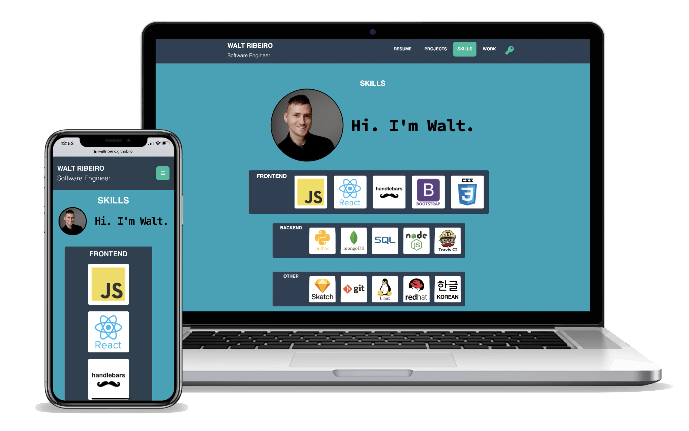

# Walt Ribeiro's Portfolio

## [Projects](#Projects) &nbsp;&bull;&nbsp; [Sections](#Sections) &nbsp;&bull;&nbsp; [Purpose](#Purpose) &nbsp;&bull;&nbsp; [Bugs](#Bugs) &nbsp;&bull;&nbsp; [Screenshot](#Screenshot)

## Projects
* https://waltribeiro.github.io/season-all-app
* https://phlask.me/find-water
* https://waltribeiro.github.io/burger-view-controller
* https://waltribeiro.github.io/soundtrack-that-movie
* https://waltribeiro.github.io/arduino
* https://waltribeiro.github.io/node-employee
* https://waltribeiro.github.io/javascript-personal-02-piano
* https://waltribeiro.github.io/weather-web-api
* https://waltribeiro.github.io/password-generator

## Sections
* [Projects](https://waltribeiro.github.io/#projects)
* [Work Experience](https://waltribeiro.github.io/#work)
* [Certifications](https://waltribeiro.github.io/#certifications)

## Purpose
To have an up-to-date central location of my resume and projects that I've been a part of, including:
- Web API calls
- Javascript apps
- Python Scripts
- JQuery libraries
- C++ electronics
- Front End Web Design Certifications and more

## Bugs?
Contact me on twitter http://twitter.com/waltribeiro

Contact me on email w@waltrib.com 

## Screenshot

